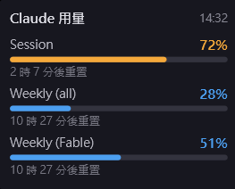
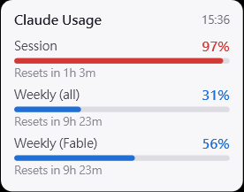

# Claude Usage Widget

A tiny Windows desktop widget that shows your **Claude plan usage in real time** — the same numbers you see on Claude's `/usage` screen (session %, weekly %, per-model weekly %), always visible on your desktop.

一個常駐 Windows 桌面的小工具，即時顯示你的 **Claude 方案使用量**——和 Claude `/usage` 畫面完全同步（Session %、每週 %、各模型每週 %）。

| Dark theme (繁體中文) | Light theme (English) |
| :---: | :---: |
|  |  |

## Features / 功能

- 🪟 **Floating widget** — always-on-top, draggable, remembers position
- 🔔 **Tray icon** — live percentage ring drawn into the icon; hover for details, left-click to show/hide
- 🔄 **Auto refresh** (60 s / 90 s / 2 min / 5 min, default 90 s); colors shift orange at 70% and red at 90%
- ⏰ **Reset countdown** for each limit (e.g. "resets in 2 hr 38 min")
- ⚙️ **Settings** — language (English / 繁體中文), dark / light theme, background transparency 0–100%
- 🚀 **Start with Windows** (optional, on by default, toggle in right-click menu)
- 🔐 **Sign in once** — browser OAuth (the same flow Claude Code's `/login` uses); tokens are encrypted with Windows DPAPI and stored only on your machine

## Install / 安裝

### Option A — Download (recommended)

1. Grab the latest `ClaudeUsageWidget-win-x64.zip` from [Releases](../../releases)
2. Unzip anywhere (e.g. `C:\Tools\ClaudeUsageWidget\`) and run `ClaudeUsageWidget.exe`
3. A login window appears — click **開啟瀏覽器登入 / Sign in with browser** and authorize with your Claude account
4. Done. The widget appears in the top-right corner; drag it wherever you like.

> **Windows SmartScreen note:** the exe is not code-signed, so the first launch may show "Windows protected your PC". Click **More info → Run anyway**. If you prefer, build from source instead (below).
>
> **SmartScreen 提示**：exe 沒有付費數位簽章，第一次執行可能出現「Windows 已保護您的電腦」，點「其他資訊 → 仍要執行」即可。不放心的話也可以自行從原始碼編譯（見下方）。

### Option B — Build from source

Requires the [.NET 10 SDK](https://dotnet.microsoft.com/download).

```powershell
git clone https://github.com/Kilin-570/ClaudeUsageWidget.git
cd ClaudeUsageWidget
dotnet publish -c Release -r win-x64 --self-contained -p:PublishSingleFile=true -o dist
.\dist\ClaudeUsageWidget.exe
```

## Privacy & security / 隱私與安全

- Your OAuth tokens are stored **only on your PC**, encrypted with Windows DPAPI (only your Windows account can decrypt them): `%APPDATA%\ClaudeUsageWidget\tokens.dat`
- The app talks **only to Anthropic's official endpoints** (`claude.ai`, `console.anthropic.com`, `api.anthropic.com`). No telemetry, no third-party servers.
- It only **reads** usage percentages. Checking your usage does not consume tokens and does not cost anything.
- Sign out anytime: right-click the widget → 重新登入, or delete `%APPDATA%\ClaudeUsageWidget\`.

<!-- 中文 -->
- Token 只加密儲存在你自己的電腦（Windows DPAPI，只有你的 Windows 帳號能解密）
- 程式只連 Anthropic 官方端點，沒有遙測、不經過任何第三方伺服器
- 只「讀取」用量百分比——查看用量不消耗 token、不會產生費用

## FAQ

**Does it work with Pro / Max plans?** Yes — it shows whatever limits your plan has (session, weekly, per-model weekly). Buckets are parsed dynamically, so new limit types show up automatically.

**Why does it need me to sign in? Can't it read Claude Code's login?** Claude Code's desktop app keeps its token in encrypted app-internal storage that external tools can't (and shouldn't) touch. This widget does its own one-time OAuth sign-in instead.

**Will this get my account banned?** The widget uses the same official OAuth flow and usage endpoint that Claude's own clients use, read-only. That said, the usage endpoint is not a documented public API — see the disclaimer below.

## Disclaimer / 免責聲明

This is an **unofficial**, community-made tool. It is **not affiliated with or endorsed by Anthropic**. It relies on endpoints used by Claude's first-party clients which are not part of the documented public API and may change or stop working at any time. Use at your own discretion.

本工具為**非官方**社群作品，與 Anthropic 無關，亦未獲其背書。所依賴的端點並非公開文件化 API，隨時可能變動或失效，請自行斟酌使用。

## License

[MIT](LICENSE)
