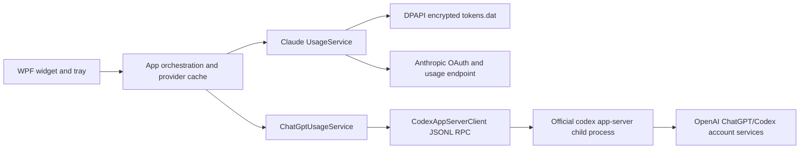

# Architecture

## Goals

- Present Claude and ChatGPT/Codex quota windows in one small Windows widget.
- Keep provider failures isolated: a Claude schema change must not break ChatGPT, and a missing Codex install must not break Claude.
- Avoid collecting OpenAI credentials in the widget.
- Preserve v1 settings, encrypted Claude tokens, executable name, updater asset name, and Startup shortcut.

## Components

## Provider contracts

Both providers normalize their data into `UsageBucket` rows:

- stable local key
- display label
- used percentage
- optional reset timestamp

`MainWindow` does not know provider response schemas. It only renders normalized rows, which keeps the visual layer stable if a backend adds or removes quota windows.

## Claude flow

1. The user completes the existing browser PKCE flow.
2. Access and refresh tokens are encrypted with DPAPI for the current Windows user.
3. `UsageService` refreshes expiring access tokens and calls the usage endpoint.
4. `UsageParser` prefers the server's dynamic `limits` array and falls back to legacy top-level buckets.

The provider remains unofficial because Anthropic does not document the usage endpoint as a public API.

## ChatGPT / Codex flow

1. `CodexLocator` checks a configured executable and `CODEX_PATH`, then the newest user-accessible Codex bundled with the unified ChatGPT desktop app, then normal PATH entries.
2. `CodexAppServerClient` starts `codex app-server --stdio` with no shell for executables and a quoted command wrapper for `.cmd`/`.bat` installs.
3. The client performs the documented `initialize` / `initialized` handshake.
4. `account/read` checks whether Codex has ChatGPT-managed authentication.
5. `account/rateLimits/read` returns the current quota windows.
6. `ChatGptUsageParser` maps primary and secondary windows into `UsageBucket` rows.

The widget never reads Codex's auth file. Browser login is started through `account/login/start`, and Codex owns the callback, storage, and token refresh.

## Reliability

- Only one refresh runs at a time.
- Provider results are cached independently so switching tabs can show the last successful value immediately.
- Claude HTTP 429 responses use bounded exponential backoff.
- A stopped Codex child process fails outstanding requests and is restarted on the next attempt.
- ChatGPT desktop Codex discovery checks only the expected user-local directory and tolerates version directories being replaced during an app update.
- Codex protocol output and stderr are deliberately not copied into widget logs.
- Schema parsers ignore unknown fields and render only complete percentage windows.

## Trade-offs

| Decision | Benefit | Cost |
| --- | --- | --- |
| Use Codex app-server | Official auth ownership; no OpenAI token handling | Requires Codex to be installed and current |
| Keep one WPF process | Small deployment and simple updater | Providers share the same UI process |
| Keep existing executable/repo names | In-place v1 upgrade remains possible | Product name and binary name differ |
| Normalize to percentage rows | Reuses a compact visual language | Non-percentage activity data is not shown yet |

## What to revisit later

- Add an optional, clearly separate OpenAI API organization-cost provider for administrators.
- Add signed releases when a code-signing identity is available.
- Replace static screenshots with current v2 captures after visual QA on a signed-in desktop.
- Consider packaging Codex discovery guidance into an onboarding screen if support volume warrants it.
